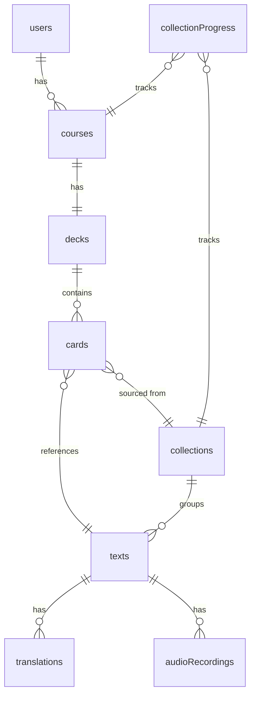
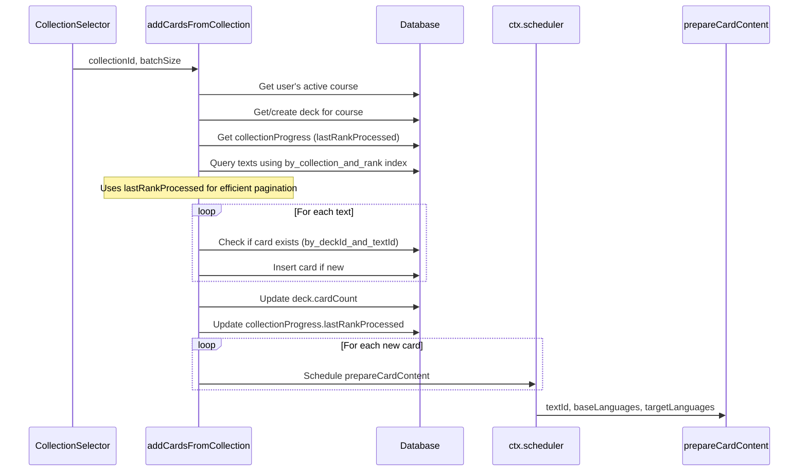
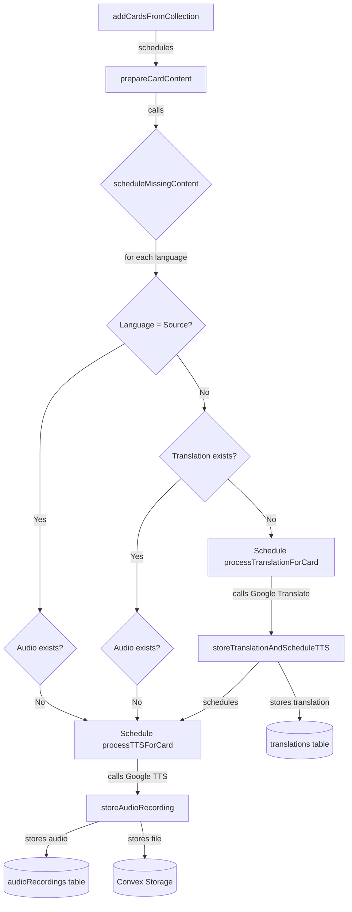
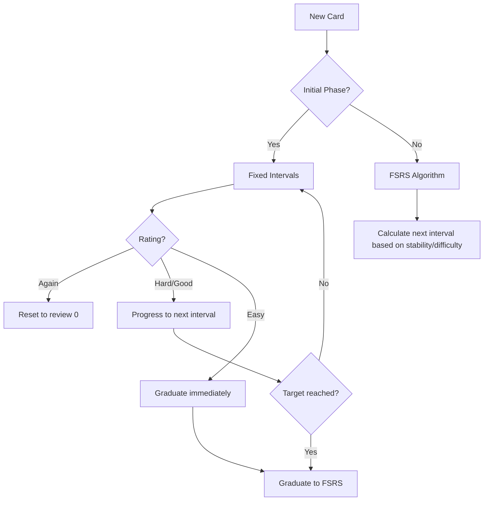

# Implementation Summary

## Data Model Overview

## Texts & Collections System

### Schema (`convex/schema.ts`)
- `collections` - groups texts by CEFR level with `name` and `textCount`
- `texts` - stores sentences with `datasetSentenceId`, `text`, `language`, `userCreated`, `collectionId`, `collectionRank`
- `translations` - stores translations linked to `textId` and `targetLanguage`
- `audioRecordings` - stores audio files using Convex file storage, linked to `textId`, `language`, and `voiceName`

### Data Seeding (`convex/data_uploading/data_management.ts`)
- `upsertCollection` - internal mutation to create/get collection by name
- `batchUpsertTexts` - internal mutation for bulk inserting up to 500 texts

### Queries (`convex/texts.ts`)
- `getCollections` - returns all collections (authenticated)
- `getTextsByCollection` - returns texts for a collection with limit (authenticated)
- `getCollectionsWithTexts` - returns collections with preview texts and count (authenticated)

### Upload Script (`scripts/uploadTexts.mjs`)
- Reads CSVs from `data_preparation/data/output/sentences_by_difficulty/`
- Creates collections per CEFR level (Essential, A1-C2)
- Batch uploads via `npx convex run [batch uploading function]`
- Run: `pnpm run seed-texts`

## Courses, Decks & Cards System

### Schema
- `courses` - stores user's language configuration (`baseLanguages`, `targetLanguages`, `currentLevel`)
- `decks` - one deck per course, auto-created with `cardCount` for efficient queries
- `cards` - links texts to decks with `dueDate`, `isMastered`, `isHidden` for spaced repetition
- `collectionProgress` - tracks per-user, per-course progress through collections using `lastRankProcessed` for efficient pagination

### How Cards Are Added

### Backend Functions (`convex/decks.ts`)

**Public Mutations:**
- `addCardsFromCollection` - adds cards from a collection to user's deck, tracks progress via `collectionProgress`

**Public Queries:**
- `getDeckForCourse` - returns the deck for user's active course
- `getDeckCards` - returns cards with translations and audio (paginated, default 20)
- `getCollectionProgress` - returns progress for all collections in active course

**Internal Functions:**
- `getOrCreateDeck` - ensures deck exists for a course
- `prepareCardContent` - schedules translation and TTS for a text's required languages

### UI Components
- `CollectionSelector` - displays collections with progress bars, batch size selector, "Add Cards" button
- `DeckCardsView` - displays cards with translations and audio playback

## Content Generation System

When cards are added, translations and audio are generated asynchronously for all course languages (both base and target).

### Content Generation Flow

### Key Implementation Details

1. **Texts are stored in English** - translations are created for user's base AND target languages
2. **Random voice selection** - `getRandomVoiceForLanguage()` picks a random Chirp3 HD voice
3. **Batch loading optimization** - queries only needed languages using `by_text_and_language` index
4. **On-demand regeneration** - `ensureCardContent` mutation checks and schedules missing content when cards are displayed

### Backend Functions (`convex/decks.ts`)

**Helper Function:**
- `scheduleMissingContent()` - shared logic for checking and scheduling missing translations/audio

**Internal Mutations:**
- `prepareCardContent` - entry point for new card content generation
- `storeTranslationAndScheduleTTS` - stores translation and schedules TTS in one transaction
- `storeAudioRecording` - stores audio file reference

**Internal Actions (call external APIs):**
- `processTranslationForCard` - calls Google Cloud Translation API
- `processTTSForCard` - calls Google Cloud TTS API, stores MP3 in Convex storage

**Public Mutation:**
- `ensureCardContent` - regenerates missing content for a specific card (called from UI when `hasMissingContent: true`)

## Translation System (Standalone)

### Backend (`convex/translation.ts`)
- `requestTranslation` - mutation creates pending request, schedules async processing
- `getTranslationRequest` - query returns request status and result
- `processTranslation` - internal action calls Google Cloud Translation API

### Constants (`lib/constants/translation.ts`)
- `MAX_TRANSLATION_LENGTH` - shared between frontend and backend

### UI (`components/testing/TranslationTest.tsx`)
- Test component with source/target language selection
- Reactive result display when translation completes

## Text-to-Speech System (Standalone)

### Backend (`convex/tts.ts`)
- `requestTTS` - mutation creates pending request, schedules async processing
- `getTTSRequest` - query returns request status, generates `audioUrl` dynamically from `storageId`
- `processTTS` - internal action calls Google Cloud TTS API (Chirp3 HD voices), stores MP3 in Convex storage

### Constants (`lib/constants/tts.ts`)
- Shared constants: `MAX_TTS_LENGTH`, `MIN_TTS_SPEED`, `MAX_TTS_SPEED`, `TTS_SPEED_OPTIONS`
- Used by both frontend and backend

### Voice Configuration (`lib/languages.ts`)
- `SUPPORTED_LANGUAGES` with Chirp3 HD voices (1 female, 1 male per accent)
- Helper functions: `getVoicesByLanguageCode`, `getLocalesByLanguageCode`, `getLocaleFromApiCode`, `getRandomVoiceForLanguage`

### UI (`components/testing/TTSTest.tsx`)
- Test component for TTS with language/accent/voice selection
- Speed control (0.5x - 1.0x)
- Reactive audio playback when generation completes

## Card Scheduling System

Cards use a two-phase spaced repetition algorithm: an initial learning phase with fixed intervals, followed by the FSRS algorithm for long-term retention.

### Scheduling Flow

### Initial Learning Phase

Cards are shown at increasing intervals until `initialReviewsTarget` reviews are completed:

| Review # | Interval |
|----------|----------|
| 1 | 1 minute |
| 2 | 3 minutes |
| 3 | 5 minutes |
| 4 | 10 minutes |
| 5 | 15 minutes |
| 6+ | +60 minutes each |
| Graduation | 1 day |

**Rating behavior during initial phase:**
- **Again** - Reset to review 0, increment lapses
- **Hard/Good** - Progress to next interval
- **Easy** - Instant graduation to 1-day interval

### Schema

**`courseSettings` table:**
- `courseId` - Reference to course
- `initialReviewsTarget` - Reviews before graduating to FSRS (default: 5)

**`cards` table scheduling fields:**
- `dueDate` - Timestamp for next review
- `stability` - FSRS memory strength
- `difficulty` - FSRS card difficulty (1-10)
- `scheduledDays` - Current interval in days
- `reps` - Total reviews completed
- `lapses` - Times rated "Again"
- `state` - 0=New, 1=Learning, 2=Review, 3=Relearning
- `lastReview` - Timestamp of last review
- `initialReviewCount` - Reviews in initial phase

### Shared Scheduling Logic (`lib/scheduling.ts`)

Pure functions shared between frontend and backend:

| Function | Purpose |
|----------|---------|
| `createInitialCardState()` | Initialize new card scheduling state |
| `calculateNextReview()` | Full state calculation after review |
| `previewNextDueDate()` | Lightweight preview for UI |
| `getAllRatingPreviews()` | Previews for all rating buttons |
| `isInInitialPhase()` | Check if card is in initial learning |
| `getPhaseDescription()` | Human-readable phase description |
| `cardToSchedulingState()` | Convert card document to scheduling state |

### Backend Functions (`convex/decks.ts`)

**Public Mutation:**
- `reviewCard` - Updates card with new scheduling state based on rating

**Public Queries:**
- `getCardsForReview` - Returns due cards with scheduling info
- `getDeckCards` - Returns all cards with full scheduling state

**Settings:**
- `updateInitialReviewsTarget` - Updates `initialReviewsTarget` in `courseSettings`

### Frontend Integration

The `SchedulerTest` component (`components/testing/SchedulerTest.tsx`) provides:
- Simulated card with time-shift controls for testing
- Rating buttons showing next due date previews
- Real card review with backend integration
- `initialReviewsTarget` slider with debounced updates
