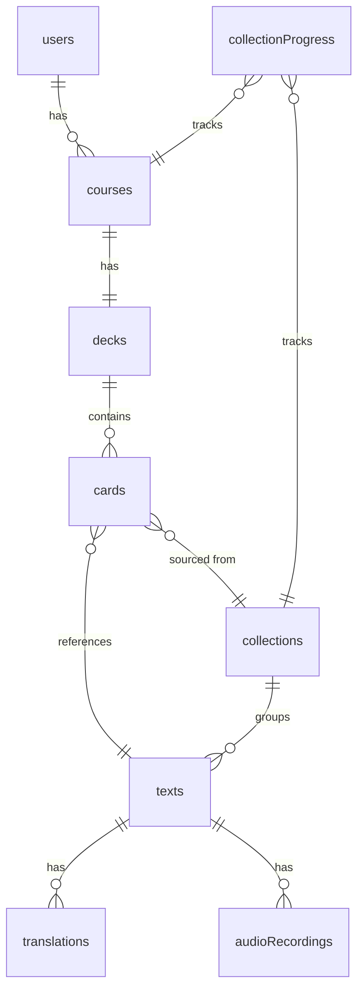
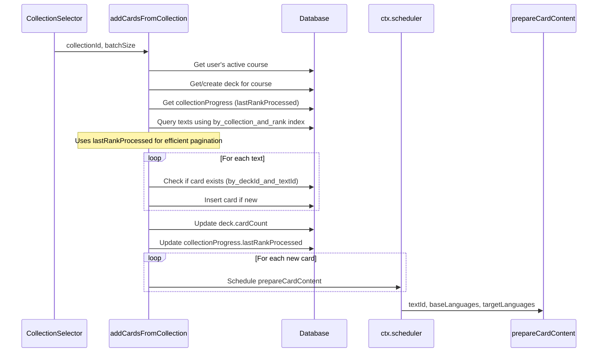
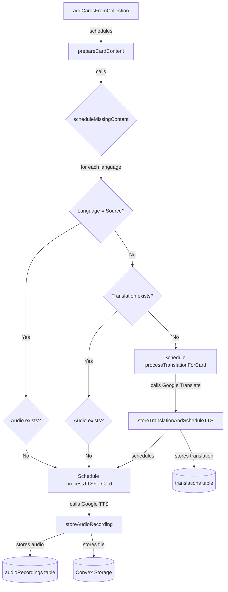
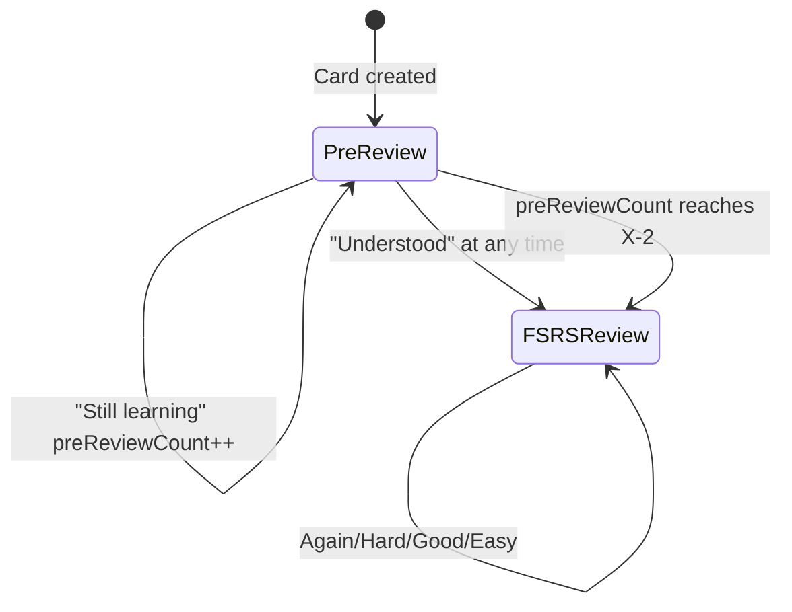
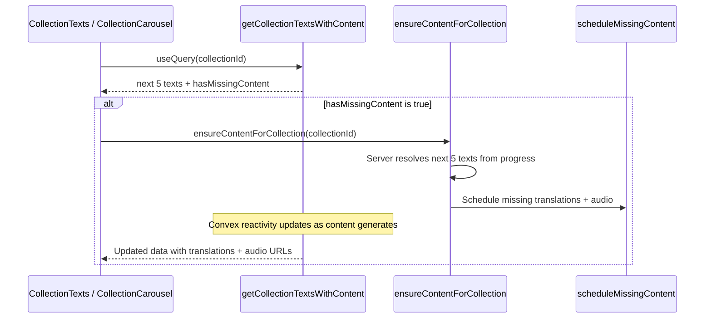

# Implementation Summary

## Data Model Overview

## Texts & Collections System

### Schema (`convex/schema.ts`)

- `collections` - groups texts by CEFR level with `name` and `textCount` and other topics/groupings are possible in the future
- `texts` - stores sentences with `datasetSentenceId`, `text`, `language`, `userCreated`, `collectionId`, `collectionRank`
- `translations` - stores translations linked to `textId` and `targetLanguage`
- `audioRecordings` - stores audio files using Convex file storage, linked to `textId`, `language`, and `voiceName`

### Data Seeding (`convex/db/seed.ts`)

- `upsertCollection` - internal mutation to create/get collection by name
- `batchUpsertTexts` - internal mutation for bulk inserting up to 500 texts
- `adjustCollectionTextCount` - helper to update collection text counts

### Queries (`convex/testing/texts.ts`)

- `getCollectionsWithTexts` - returns collections with preview texts and count (authenticated)

### Upload Script (`scripts/uploadTexts.mjs`)

- Reads CSVs from `data_preparation/data/output/sentences_by_difficulty/`
- Creates collections per CEFR level (Essential, A1-C2)
- Batch uploads via `npx convex run [batch uploading function]`
- Run: `pnpm run seed-texts`

## Courses, Decks & Cards System

### Schema

- `courses` - stores user's language configuration (`baseLanguages`, `targetLanguages`, `currentLevel`)
- `courseSettings` - stores course-specific settings (`initialReviewCount`) in a separate table to avoid course re-fetches when settings change
- `decks` - one deck per course, auto-created with `cardCount` for efficient queries
- `cards` - links texts to decks with scheduling state: `dueDate`, `isMastered`, `isHidden`, `schedulingPhase`, `preReviewCount`, `fsrsState`
- `collectionProgress` - tracks per-user, per-course progress through collections using `lastRankProcessed` for efficient pagination

### How Cards Are Added

### Backend Functions (`convex/features/decks.ts`)

**Public Mutations:**

- `addCardsFromCollection` - adds cards from a collection to user's deck, tracks progress via `collectionProgress`
- `ensureCardContent` - regenerates missing content for a specific card (called from UI when `hasMissingContent: true`)

**Public Queries:**

- `getDeckCards` - returns cards with translations and audio (paginated, default 20)
- `getCollectionProgress` - returns progress for all collections in active course

**Internal Functions:**

- `prepareCardContent` - schedules translation and TTS for a text's required languages

### UI Components

- `CollectionSelector` - displays collections with progress bars, batch size selector, "Add Cards" button
- `DeckCardsView` - displays cards with translations and audio playback

## Content Generation System

When cards are added, translations and audio are generated asynchronously for all course languages (both base and target).

### Content Generation Flow

### Key Implementation Details

1. **Texts are stored in English** - translations are created for user's base AND target languages
2. **Random voice selection** - `getRandomVoiceForLanguage()` picks a random Chirp3 HD voice
3. **Batch loading optimization** - queries only needed languages using `by_text_and_language` index
4. **On-demand regeneration** - `ensureCardContent` mutation checks and schedules missing content when cards are displayed

### Backend Functions (`convex/features/decks.ts`)

**Helper Function:**

- `scheduleMissingContent()` - shared logic for checking and scheduling missing translations/audio

**Internal Mutations:**

- `prepareCardContent` - entry point for new card content generation
- `storeTranslationAndScheduleTTS` - stores translation and schedules TTS in one transaction
- `storeAudioRecording` - stores audio file reference

**Internal Actions (call external APIs):**

- `processTranslationForCard` - calls Google Cloud Translation API
- `processTTSForCard` - calls Google Cloud TTS API, stores MP3 in Convex storage

**Shared Helpers:**

- `convex/features/translation.ts` - `translateText()` plain async helper wrapping Google Cloud Translation API
- `convex/features/tts.ts` - `synthesizeSpeech()` plain async helper wrapping Google Cloud TTS API

## Translation System (Standalone Testing)

### Backend (`convex/testing/translation.ts`)

- `requestTranslation` - mutation creates pending request, schedules async processing
- `getTranslationRequest` - query returns request status and result
- `processTranslation` - internal action calls Google Cloud Translation API

### Constants (`lib/constants/translation.ts`)

- `MAX_TRANSLATION_LENGTH` - shared between frontend and backend

### UI (`components/testing/TranslationTest.tsx`)

- Test component with source/target language selection
- Reactive result display when translation completes

## Text-to-Speech System (Standalone Testing)

### Backend (`convex/testing/tts.ts`)

- `requestTTS` - mutation creates pending request, schedules async processing
- `getTTSRequest` - query returns request status, generates `audioUrl` dynamically from `storageId`
- `processTTS` - internal action calls Google Cloud TTS API (Chirp3 HD voices), stores MP3 in Convex storage

### Constants (`lib/constants/tts.ts`)

- Shared constants: `MAX_TTS_LENGTH`, `MIN_TTS_SPEED`, `MAX_TTS_SPEED`, `TTS_SPEED_OPTIONS`
- Used by both frontend and backend

### Voice Configuration (`lib/languages.ts`)

- `SUPPORTED_LANGUAGES` with Chirp3 HD voices (1 female, 1 male per accent)
- Helper functions: `getVoicesByLanguageCode`, `getLocalesByLanguageCode`, `getLocaleFromApiCode`, `getRandomVoiceForLanguage`

### UI (`components/testing/TTSTest.tsx`)

- Test component for TTS with language/accent/voice selection
- Speed control (0.5x - 1.0x)
- Reactive audio playback when generation completes

## Card Review & Scheduling System

Cards use a two-phase spaced repetition system powered by the [ts-fsrs](https://github.com/open-spaced-repetition/ts-fsrs) library.

### Two-Phase Scheduling Model

**Phase 1 — Pre-review:**

- `preReviewCount` starts at 0, card shown with fixed intervals: 1 min, 3 min, 5 min, then every 10 min
- Options: "Still learning" (default) / "Understood"
- Transitions to FSRS when user selects "Understood" OR `preReviewCount` reaches `initialReviewCount - 2`

**Phase 2 — FSRS review:**

- Uses FSRS algorithm with `desired_retention: 0.95` and two learning steps `["10m", "10m"]`
- Options: Again / Hard / Good (default) / Easy
- Produces review intervals of approximately 1, 3, 9, 18 days
- The `-2` threshold ensures total initial exposure = `initialReviewCount` (pre-review + 2 FSRS learning reviews)

### Shared Scheduling Logic (`lib/scheduling.ts`)

All scheduling logic lives in a single pure TypeScript module with no Convex/React dependencies, importable from both backend and frontend:

- `DEFAULT_INITIAL_REVIEW_COUNT = 5` — single source of truth
- `scheduleCard(cardState, rating, initialReviewCount, now)` — main entry-point for all scheduling
- `createInitialCardState(now)` — factory for new card scheduling state
- `getPreReviewInterval(reviewCount)` — returns pre-review interval in ms
- `simulateReviews(initialReviewCount, ratings[])` — simulates a review sequence for the test UI
- `getValidRatings(phase)` / `getDefaultRating(phase)` — UI helpers

### FSRS Configuration

| Parameter           | Value            |
| ------------------- | ---------------- |
| `request_retention` | 0.95             |
| `maximum_interval`  | 36500 days       |
| `enable_fuzz`       | false            |
| `enable_short_term` | true             |
| `learning_steps`    | `["10m", "10m"]` |
| `relearning_steps`  | `["10m"]`        |

### Schema Fields

**Cards** (new fields alongside existing `dueDate`, `isMastered`, `isHidden`):

- `schedulingPhase` — `"preReview"` or `"review"`
- `preReviewCount` — number of pre-review rounds completed
- `fsrsState` — optional serialised FSRS card state (stability, difficulty, reps, lapses, state, etc.)

**Course Settings** (separate `courseSettings` table — avoids course re-fetches):

- `courseId` — reference to the course
- `initialReviewCount` — the X value controlling pre-review threshold
- `cardsToAddBatchSize` — optional, how many cards to add per batch (default 5)
- `autoAddCards` — optional, auto-add cards when none are due (default false)
- `activeCollectionId` — optional, currently selected collection

### Backend Functions (`convex/features/scheduling.ts`)

**Public Query:**

- `getCardForReview` — returns the next due card (earliest `dueDate <= now`, not hidden) with text, translations, and audio

**Public Mutation:**

- `reviewCard` — takes `cardId` + `rating`, delegates to shared `scheduleCard()`, patches card document

### UI Components

- `SchedulingTest` (`components/testing/SchedulingTest.tsx`) — developer test component with two tabs:
  - **Virtual Simulation** — interactive step-by-step scheduling with adjustable `initialReviewCount`, quick preview table, FSRS state display
  - **Real Cards** — reviews actual cards from the user's deck with the real `reviewCard` mutation

## Learning Mode

An immersive full-screen learning session at `/app/learn` for reviewing flashcards using the spaced repetition system.

### Architecture

- **Separate page** at `app/app/learn/page.tsx` (no bottom nav, own header with back + settings)
- **Entry points:** "Start Learning" button on HomeView, central Play button in BottomNav
- **Data flow:** Uses `getCardForReview` query → displays flashcard → `reviewCard` mutation on rating

### Card Display States

| State                             | UI                                                     |
| --------------------------------- | ------------------------------------------------------ |
| Card due (preReview)              | Flashcard + "Still learning" / "Understood" buttons    |
| Card due (review)                 | Flashcard + "Again" / "Hard" / "Good" / "Easy" buttons |
| No cards due, collection selected | "Add X more cards" button (+ auto-add logic)           |
| No collection selected            | Message + "Go to Home" button                          |
| Loading                           | Skeleton                                               |

### Flashcard Layout (top to bottom)

1. **Header** — back button, title, settings icon
2. **Card content** — base language texts with audio icons, separator, target language texts with audio icons
3. **Card metadata** — phase badge, review count, next review time
4. **Master / Hide action buttons**
5. **Rating buttons row** — phase-dependent (pre-review vs FSRS ratings)
6. **Play / Next button row**

### Schema Extensions

`courseSettings` table gained two new optional fields:

- `cardsToAddBatchSize` (number, default 5) — how many cards to add at once
- `autoAddCards` (boolean, default false) — auto-add cards when none are due

### Backend Functions

**New mutations in `convex/features/scheduling.ts`:**

- `masterCard({ cardId })` — sets `isMastered: true` on the card
- `hideCard({ cardId })` — sets `isHidden: true` on the card

**Updated mutation in `convex/features/courses.ts`:**

- `updateCourseSettings` — now accepts optional `cardsToAddBatchSize` and `autoAddCards` fields

### Frontend Components

- `LearningMode` (`components/app/LearningMode.tsx`) — main learning session component with flashcard display, rating buttons, master/hide actions, audio playback, auto-add logic
- `LearningModeSettings` (`components/app/LearningModeSettings.tsx`) — Sheet panel with cards-per-batch, initial reviews, and auto-add toggle

### Internationalization

All UI text is internationalized under the `LearningMode` namespace in `messages/en.json` and `messages/de.json`, covering:

- Header, phase labels, rating buttons, card actions
- Empty state messages, settings panel labels

### Learning Audio Refactor (Current Branch)

The learning mode audio flow was refactored from sequential per-clip playback logic inside `useLearningMode` into a dedicated merged-audio pipeline with its own hook and utilities.

#### What Changed

- `components/app/learning/useLearningAudio.ts` was introduced as an adapter between `useLearningMode` state and the audio player hook
- `hooks/use-audio-player.ts` was added to manage merge lifecycle, playback controls, seek, media session actions, and cleanup
- `lib/audio/mergeAudio.ts` was added to:
  - resolve playback sequence from language order + repetition settings
  - fetch/decode source clips
  - render a single timeline with `OfflineAudioContext`
  - export a playable WAV blob URL
- `lib/audio/mediaSession.ts` was added to centralize Media Session metadata/action wiring and position updates
- `components/app/learning/AudioProgressBar.tsx` was added and integrated into `LearningControls` for timeline scrubbing + elapsed/total time display
- `components/app/LearningMode.tsx` now consumes `useLearningAudio(state)` and passes explicit audio controls to `LearningControls`
- `components/app/learning/useLearningMode.ts` removed the previous in-hook auto-play orchestration (wait/play loops, abort handling, and auto-advance timing are now handled by merged playback)
- `components/app/learning/LearningCardContent.tsx` no longer passes `stopPlayback` to per-language `AudioButton`s

#### UI/UX Impact

- Controls changed from `Auto Play / Stop` semantics to direct merged-track controls:
  - restart
  - play/pause
  - seek via progress bar
  - next card
- Playback now represents the full configured card sequence as one continuous track (base + target ordering, repetitions, and pauses)
- Media Session handlers now expose play/pause/next/previous interactions on supported platforms

#### Dependencies

- Added: `audiobuffer-to-wav` (used by `mergeAudio.ts` to encode rendered audio buffer)
- Added in current diff but likely unrelated to this implementation: `install` (no direct runtime import found in app code)

#### Follow-ups Before Commit

- Add a declaration or typed wrapper for `audiobuffer-to-wav` to resolve current TypeScript lint/type error
- Confirm whether `install` is intentional; remove if accidental
- Revisit merge gating: current logic requires all `audioRecordings` URLs to be present before merged playback initializes
- Confirm desired behavior for inline `AudioButton` playback when opening settings, since explicit stop wiring was removed

## Collection Preview System

When a user expands a collection (in either the testing page or the home view), the next `COLLECTION_PREVIEW_SIZE` (5) texts are displayed with translations and audio for all active course languages — matching the flashcard experience.

### How It Works

### Backend Functions (`convex/features/collections.ts`)

**Public Query:**

- `getCollectionTextsWithContent({ collectionId })` — returns the next `COLLECTION_PREVIEW_SIZE` texts based on user's `collectionProgress`, enriched with translations and audio for all active course languages. Includes a top-level `hasMissingContent` flag.

**Public Mutation:**

- `ensureContentForCollection({ collectionId })` — server-side only accepts a `collectionId`; resolves the next preview texts from the user's progress and calls `scheduleMissingContent` for each. The frontend cannot control which texts get generated.

### Pre-generation on Card Addition

When `addCardsFromCollection` (in `convex/features/decks.ts`) adds cards and updates progress, it also pre-generates content for the next `COLLECTION_PREVIEW_SIZE` texts beyond the new progress point. This means preview content is usually ready before the user opens the collection.

### Frontend Deduplication

Both `CollectionTexts` (testing page) and `CollectionCarousel` (home view) use a `useRef<Set<string>>` with composite keys of `"${courseId}:${collectionId}"` to avoid re-triggering `ensureContentForCollection` for the same course+collection combination within a session. The key is deleted when cards are added (so the next preview batch can trigger generation).

### Constants

- `COLLECTION_PREVIEW_SIZE = 5` defined in `convex/lib/collections.ts`, used by the query, mutation, and pre-generation logic.

## Shared Database & Content Helpers

Repeated patterns were extracted into shared helper modules to reduce duplication across `convex/features/collections.ts` and `convex/features/decks.ts`.

### Database Helpers (`convex/db/collections.ts`)

- `getCollectionProgress(ctx, userId, courseId, collectionId)` — queries `collectionProgress` by the `by_userId_and_courseId_and_collectionId` index. Replaces 6+ inline occurrences.
- `getNextTextsFromRank(ctx, collectionId, afterRank, limit)` — queries `texts` by `by_collection_and_rank` index with rank-based pagination. Replaces 4+ inline occurrences.

### Content Batch Helper (`convex/lib/cardContent.ts`)

- `buildTextContentBatchForLanguages(ctx, inputs, baseLanguages, targetLanguages)` — given an array of `TextContentInput` objects (key, textId, sourceText, sourceLanguage), batch-fetches all translations and audio recordings, resolves storage URLs, and returns a `Map<string, TextContentResult>` with assembled translations, audio, and `hasMissingContent` per text. Used by both `getCollectionTextsWithContent` and `getDeckCards`.
- `getCourseLanguages(baseLanguages, targetLanguages)` — deduplicates base + target language arrays.

### Audio Helper (`convex/lib/audio.ts`)

- `getAudioForText(ctx, textId, languages)` — fetches audio recordings with resolved storage URLs for a single text across the given languages. Used by `getCardForReview` in `scheduling.ts`.

## Performance Optimizations

1. **Efficient pagination** - uses `lastRankProcessed` in `collectionProgress` instead of offset/skip
2. **Denormalized counts** - `deck.cardCount` and `collection.textCount` avoid expensive `.collect()` calls
3. **Targeted queries** - queries only needed languages using compound indexes
4. **Batch scheduling** - single mutation schedules all content generation, avoiding action→mutation round trips
5. **On-the-fly URL generation** - `audioRecordings` stores `storageId`, URL generated via `ctx.storage.getUrl()`
6. **Flat-batch content loading** - `buildTextContentBatchForLanguages` issues all translation + audio DB reads in a single `Promise.all` pass across all texts, then resolves storage URLs in a second parallel pass, avoiding N+1 query patterns
